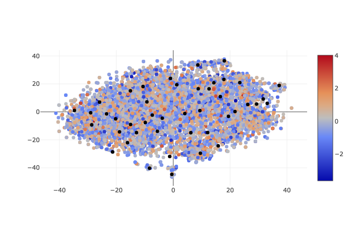
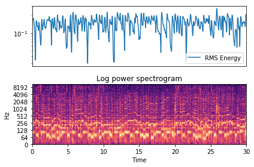

# Content-based Song Recommender

Songs are recommended based on their lyrics using basic NLP techniques after applying Exploratory Data Analysis on the [Song-Lyric-Dataset](https://www.kaggle.com/mousehead/songlyrics)

Also audio analysis on multiple genres is performed to extract various Timbral, Temporal, MFCC etc. based features. These features are then combined to classify genre of each audio.

 
